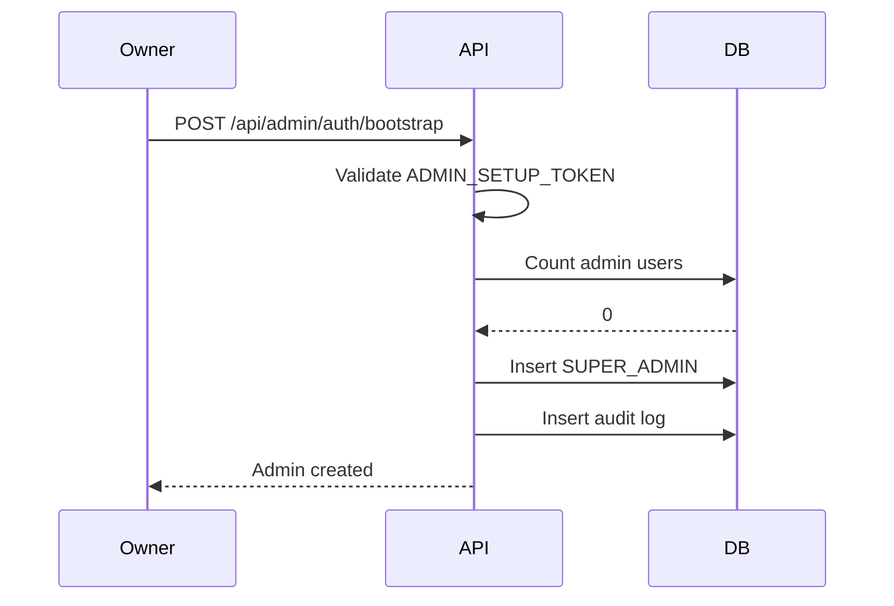
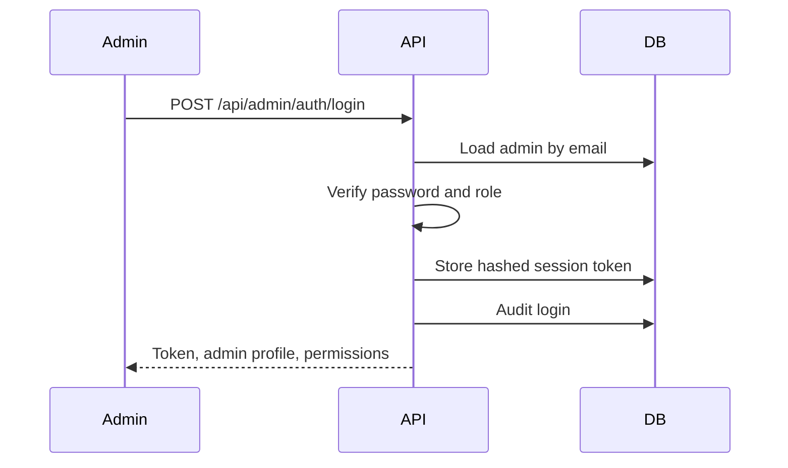
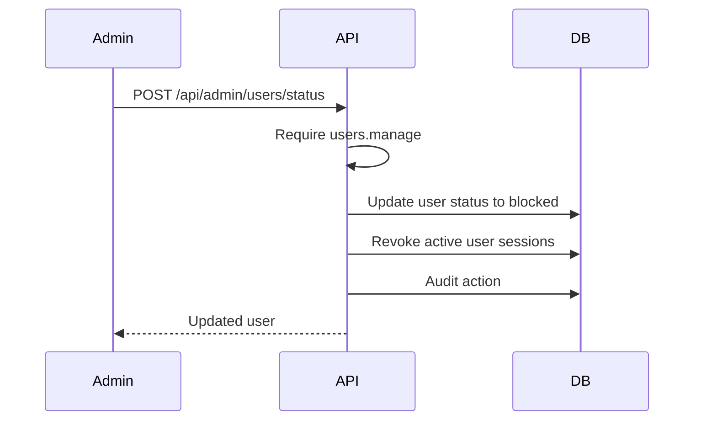
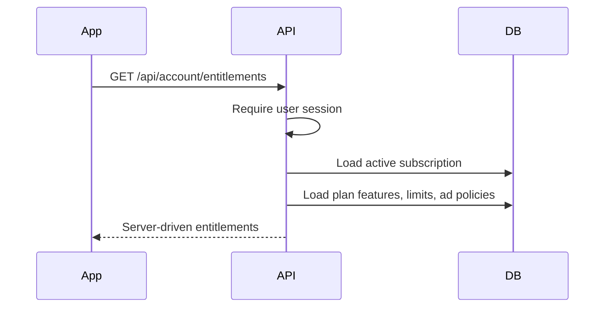

# Micham Admin, Plans, Features, and Ads Architecture

## Scope

This foundation keeps Micham offline-first. User data continues to live locally first, syncs through the custom serverless API, and uses Supabase PostgreSQL as storage. Supabase Auth is not used.

This layer adds backend-managed business controls:

- Admin accounts, sessions, roles, and audit logs.
- User management, suspension, session revocation, and plan assignment.
- Plans, features, plan features, and future plan limits.
- Public runtime settings, feature flags, announcements, and ad placement configuration.
- User entitlement lookup for server-driven UI and future enforcement.

Plan limit enforcement, payments, billing, and ad provider SDK integration are intentionally not implemented here.

## Modules

### Admin Auth

Tables:

- `micham_admin_users`
- `micham_admin_sessions`
- `micham_admin_audit_logs`

Serverless endpoints:

- `POST /api/admin/auth/bootstrap`
- `POST /api/admin/auth/login`
- `GET /api/admin/auth/me`
- `POST /api/admin/auth/logout`

Bootstrap is protected by `ADMIN_SETUP_TOKEN` and only works while there are no admin users. Admin sessions are JWTs stored by hash in `micham_admin_sessions`, separate from app user sessions.

Roles:

- `SUPER_ADMIN`: full access.
- `ADMIN`: user, plan, feature, settings, ads, announcements, audit access.
- `SUPPORT`: dashboard, user read, audit read.
- `VIEWER`: dashboard, user read, audit read.

### User Management

Endpoints:

- `GET /api/admin/users/list`
- `POST /api/admin/users/status`
- `POST /api/admin/users/revoke-sessions`
- `POST /api/admin/users/assign-plan`

Suspending a user maps to the existing app user status `blocked` and revokes active user sessions. This does not delete synced local data rows.

### Plan and Feature Catalog

Tables:

- `micham_plans`
- `micham_features`
- `micham_plan_features`
- `micham_plan_limits`
- `micham_user_subscriptions`

Endpoints:

- `GET /api/admin/catalog`
- `POST /api/admin/plans/save`
- `POST /api/admin/features/save`
- `POST /api/admin/features/set-plan`
- `GET /api/account/entitlements`

Seeded plan:

- `FREE`

Seeded features:

- `CLOUD_SYNC`
- `FRIENDS`
- `SETTLEMENTS`
- `AI_ASSISTANT`
- `REPORT_EXPORT`
- `ADVANCED_REPORTS`
- `RECEIPTS`

Existing active app users are assigned to the default `FREE` plan by migration when they do not already have an active or trial subscription.

### Runtime Controls

Tables:

- `micham_feature_flags`
- `micham_system_settings`
- `micham_announcements`

Endpoints:

- `GET /api/config/runtime`
- `POST /api/admin/settings/save`
- `POST /api/admin/announcements/save`

Public runtime config only returns settings marked `is_public = true`. Admin-only values stay behind admin endpoints.

### Ads Foundation

Tables:

- `micham_ad_placements`
- `micham_ad_configs`
- `micham_plan_ad_policies`

Endpoints:

- `POST /api/admin/ads/save`
- `GET /api/admin/catalog`
- `GET /api/config/runtime`

This is only configuration and policy storage. No ad SDK, impression tracking, or provider integration is active.

## Flows

### Admin Bootstrap

### Admin Login

### User Suspension

### Entitlements

## Environment

Required server variables:

- `SUPABASE_URL`
- `SUPABASE_SECRET_KEY` or `SUPABASE_SERVICE_ROLE_KEY`
- `SERVER_JWT_SECRET`
- `ADMIN_SETUP_TOKEN`

SMTP variables are still used by the existing account verification, password reset, and export email flows.

## Security Rules

- Admin tables are RLS-enabled and not granted to `anon` or `authenticated`.
- Serverless endpoints access admin tables only through the Supabase service role.
- Admin JWTs are stored as hashes and have a 12-hour session window.
- Every privileged write endpoint writes an audit log.
- User suspension revokes active app user sessions.
- Runtime public config only exposes explicitly public settings.

## Current Boundaries

- Existing offline-first data, friend, settlement, and sync flows remain unchanged.
- The existing in-app `AdminView` is still local app branding/configuration. The server-side admin APIs added here are the foundation for the production business admin panel and should be wired into a separate protected admin surface.
- Plan limits are stored but not enforced in transaction/friend/sync APIs yet.
- Ads are stored as placements/configs/policies only.
- Payments and billing providers are not part of this foundation.
