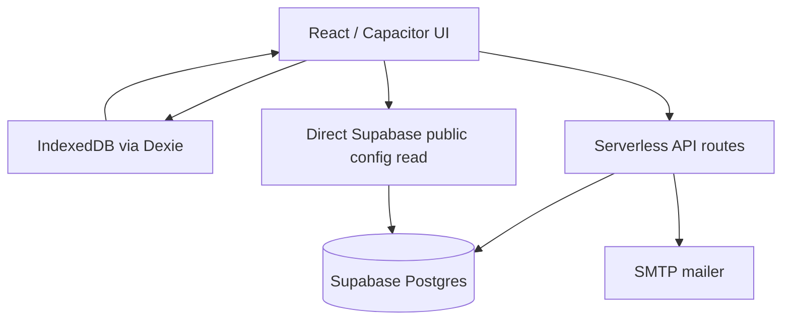
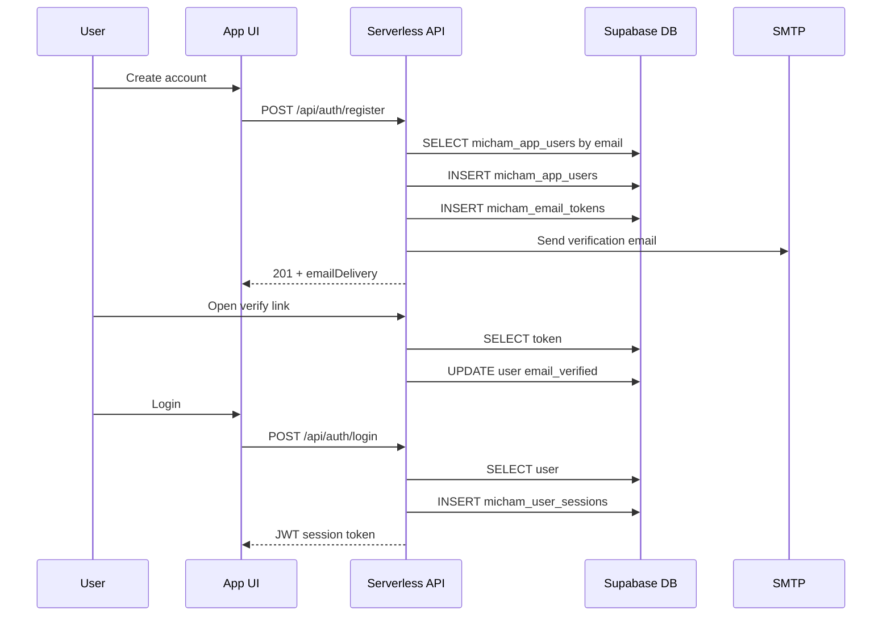
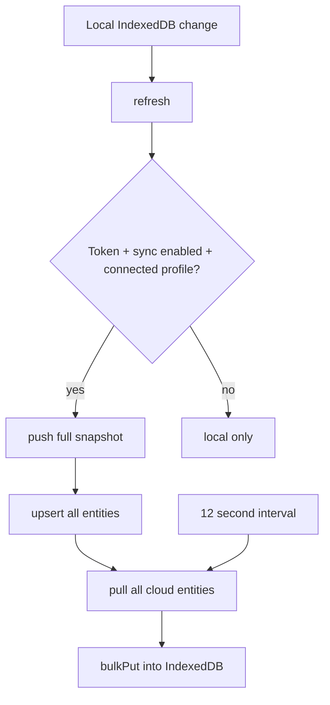
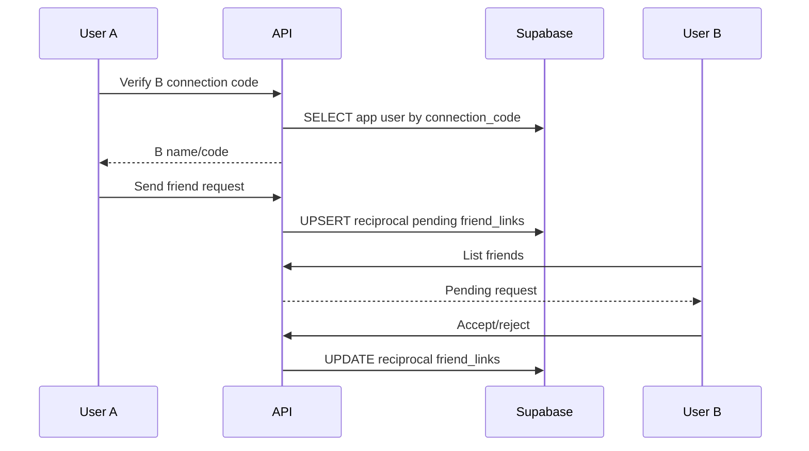
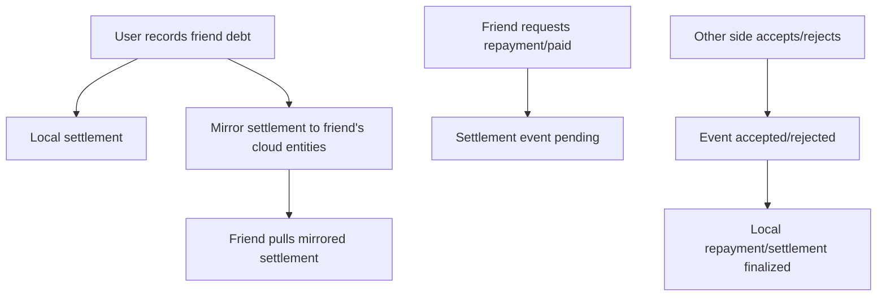
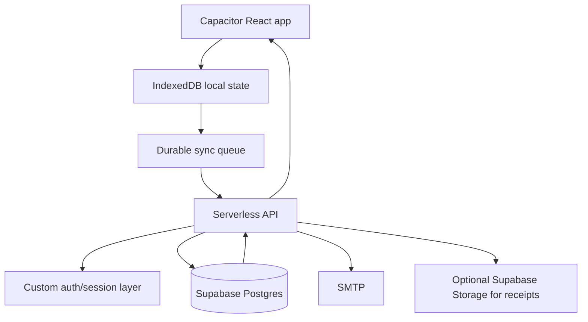

# Micham Supabase, Security, Sync, and Error Handling Audit

Audit date: 2026-09-03  
Scope: audit only. No application code, SQL migrations, environment files, or live database state were modified.

## Executive Summary

Micham is currently an offline-first React/Vite/Capacitor app with IndexedDB as the primary local store. Cloud sync is implemented through serverless API routes in `api/`, using Supabase as the database only. Supabase Auth is no longer the primary authentication system; the app uses custom app-user tables, password hashes, email tokens, sessions, and SMTP mail through serverless endpoints.

The overall direction is workable for 100 to 500 users on Supabase free tier if usage remains light, but the current sync model is not efficient enough for heavier real-world use. The highest-risk areas are full-snapshot sync, no pagination, old Supabase-auth SQL still present, service-role-heavy APIs, broad friend mirroring, limited idempotency, limited retry/backoff, and raw server errors being returned to clients.

Current biggest findings:

| Severity | Area | Finding | Impact |
| --- | --- | --- | --- |
| High | Sync | `/api/sync/push` uploads the full local snapshot, not dirty changes only. | Supabase rows, bandwidth, serverless execution, and client CPU grow quickly with data size. |
| High | Sync | `/api/sync/pull` pulls every cloud entity for the user every time, with no cursor or pagination. | Repeated reads become expensive and slow as each account grows. |
| High | Security | Server error handler returns raw internal error messages for non-`ApiError` failures. | Supabase/schema/env details can leak to users. |
| High | Authorization | Friend mirror endpoint accepts caller-provided `entityType`, `entityId`, and payload after only connected-friend check. | A connected user can write arbitrary allowed entity payloads into the friend's cloud namespace. |
| Medium | Architecture | Migrations still include old Supabase Auth/RLS/RPC flow while active app uses custom serverless auth. | Confusing operations and higher risk of wrong future changes. |
| Medium | Reliability | `syncQueue` exists in IndexedDB but is not used as a durable replay queue. | Offline changes can be difficult to reason about during failures. |
| Medium | Realtime | Supabase realtime tables are configured, but frontend uses polling/server APIs rather than subscriptions. | Friend/settlement updates are not truly realtime. |
| Medium | Rate limits | Register/login/reset are rate limited, but sync/friend/export endpoints are not. | A client can produce excessive serverless and Supabase load. |
| Medium | Error UX | Some destructive flows still use browser `confirm()`/`alert()` and many async actions lack clear loading states. | User confusion and repeated clicks. |

## Project Structure

Relevant code paths inspected:

| Path | Purpose |
| --- | --- |
| `src/main.tsx` | Main React application, local auth flow, views, sync triggers, friends UI, settings, AI chat. |
| `src/lib/db.ts` | Dexie/IndexedDB schema and initial local seed. |
| `src/lib/serverApi.ts` | Browser API client for custom serverless backend and local cloud merge helpers. |
| `src/lib/cloud.ts` | Direct browser Supabase client used for public app config only. |
| `src/lib/types.ts` | Local entity types. |
| `api/_lib/http.ts` | Serverless request validation and error responses. |
| `api/_lib/security.ts` | Password hashing, JWT sessions, auth middleware, DB rate-limit RPC. |
| `api/_lib/supabaseAdmin.ts` | Supabase service-role client for API routes. |
| `api/_lib/mailer.ts` | SMTP email sender. |
| `api/auth/*` | Register, login, email verification, password reset, account deletion. |
| `api/sync/*` | Full snapshot push/pull. |
| `api/friends/*` | Friend verify, request, respond, block, remove, mirror, list. |
| `api/settlements/*` | Repayment request/response/list. |
| `api/transactions/update.ts` | Server-side transaction edit audit. |
| `api/export/email.ts` | Email export of server entities as Excel-compatible XML. |
| `api/email-templates/*` | HTML/text email templates. |
| `supabase/migrations/*` | Database schema history. |
| `supabase/schema.sql` | Initial schema snapshot. |

## Current Architecture

Important implementation detail: custom API auth, not Supabase Auth, is the active authentication path. Supabase Auth helper RPCs and `auth.uid()` policies remain in migrations, but the active API uses the service role and derives user identity from `micham_user_sessions`.

## Authentication Flow

Local-only flow stays in IndexedDB until the user manually creates/connects a cloud account from settings.

## Supabase Usage Inventory

### Frontend direct Supabase

| File | Operation | Table/RPC | Auth context | Notes |
| --- | --- | --- | --- | --- |
| `src/lib/cloud.ts` | `SELECT payload` | `micham_app_config` | anon/publishable key | Used on app startup to pull public app config. No Supabase session persistence. |

No direct frontend Supabase Auth, Storage, insert, update, delete, RPC, or active realtime subscription was found.

### Serverless API Supabase usage

| Endpoint/File | Operation | Table/RPC | Purpose | Risk |
| --- | --- | --- | --- | --- |
| `api/auth/register.ts` | `RPC` | `micham_take_rate_limit` | Registration rate limit. | Good control, but DB-backed rate-limit table grows by bucket. |
| `api/auth/register.ts` | `SELECT` | `micham_app_users` | Check duplicate email. | Correct. |
| `api/auth/register.ts` | `INSERT ... SELECT` | `micham_app_users` | Create custom user. | Correct, relies on service role. |
| `api/auth/register.ts` | `INSERT` | `micham_email_tokens` | Create email verification token. | Correct. |
| `api/auth/login.ts` | `RPC` | `micham_take_rate_limit` | Login rate limit. | Email-only bucket allows distributed IP guessing against one email. |
| `api/auth/login.ts` | `SELECT` | `micham_app_users` | Load password hash and verification status. | Correct. |
| `api/_lib/security.ts` | `INSERT` | `micham_user_sessions` | Create session token hash. | Correct. |
| `api/_lib/security.ts` | `SELECT` | `micham_user_sessions` | Validate bearer token. | Happens for every protected request. |
| `api/_lib/security.ts` | `SELECT` | `micham_app_users` | Load active user. | Happens for every protected request. |
| `api/auth/verify-email.ts` | `SELECT` | `micham_email_tokens` | Validate token hash. | Correct. |
| `api/auth/verify-email.ts` | `UPDATE` | `micham_app_users` | Mark email verified. | Correct. |
| `api/auth/verify-email.ts` | `UPDATE` | `micham_email_tokens` | Mark token used. | Correct. |
| `api/auth/request-reset.ts` | `RPC` | `micham_take_rate_limit` | Reset rate limit. | Good. |
| `api/auth/request-reset.ts` | `SELECT` | `micham_app_users` | Find account. | Should avoid account enumeration; current result appears generic. |
| `api/auth/request-reset.ts` | `INSERT` | `micham_email_tokens` | Create reset token. | Correct. |
| `api/auth/confirm-reset.ts` | `SELECT` | `micham_email_tokens` | Validate reset token. | Correct. |
| `api/auth/confirm-reset.ts` | `UPDATE` | `micham_app_users` | Save new password hash. | Correct. |
| `api/auth/confirm-reset.ts` | `UPDATE` | `micham_email_tokens` | Mark token used. | Correct. |
| `api/auth/confirm-reset.ts` | `UPDATE` | `micham_user_sessions` | Revoke sessions. | Correct. |
| `api/auth/delete-account.ts` | `DELETE` | `micham_app_users` | Delete account. | Cascades server data; must be protected by strong confirmation. |
| `api/sync/push.ts` | `UPSERT` | `micham_profiles` | Cloud profile row. | Good basic shape. |
| `api/sync/push.ts` | `UPSERT` | `micham_entities` | Full snapshot sync. | High cost at scale; not incremental. |
| `api/sync/pull.ts` | `SELECT` | `micham_profiles` | Pull profile. | Correct. |
| `api/sync/pull.ts` | `SELECT` | `micham_entities` | Pull all user entities. | High cost at scale; no pagination/cursor. |
| `api/friends/verify.ts` | `SELECT` | `micham_app_users` | Resolve connection code. | Good UX check. |
| `api/friends/request.ts` | `SELECT` | `micham_app_users` | Find friend by code. | Correct. |
| `api/friends/request.ts` | `SELECT` | `micham_friend_links` | Check blocked relationship. | Correct baseline. |
| `api/friends/request.ts` | `UPSERT` | `micham_friend_links` | Create reciprocal pending links. | Upsert can overwrite existing metadata if not guarded carefully. |
| `api/friends/respond.ts` | `SELECT` | `micham_friend_links` | Validate pending request. | Correct. |
| `api/friends/respond.ts` | `UPDATE` | `micham_friend_links` | Accept/reject both reciprocal rows. | Reject maps into blocked status; this may be too strong semantically. |
| `api/friends/block.ts` | `UPDATE` | `micham_friend_links` | Block both reciprocal rows. | Correct. |
| `api/friends/remove.ts` | `DELETE` | `micham_friend_links` | Remove both reciprocal rows. | Hard delete can recreate from sync/local stale data unless local state is reconciled. |
| `api/friends/list.ts` | `SELECT` | `micham_friend_links` joined to `micham_app_users` | Load friend list. | No pagination, probably fine for small friend counts. |
| `api/friends/mirror.ts` | `SELECT` | `micham_app_users` | Find friend by code. | Correct. |
| `api/friends/mirror.ts` | `SELECT` | `micham_friend_links` | Confirm connected status. | Correct baseline. |
| `api/friends/mirror.ts` | `UPSERT` | `micham_entities` | Write mirrored entity into friend account. | High authorization and data-shape risk. |
| `api/settlements/request-repayment.ts` | `SELECT` | `micham_friend_links` | Confirm connected status. | Correct baseline. |
| `api/settlements/request-repayment.ts` | `INSERT ... SELECT` | `micham_settlement_events` | Create repayment event. | No idempotency key; duplicate taps can duplicate events. |
| `api/settlements/respond-repayment.ts` | `SELECT` | `micham_settlement_events` | Load pending event. | Correct. |
| `api/settlements/respond-repayment.ts` | `UPDATE ... SELECT` | `micham_settlement_events` | Accept/reject event. | Race risk if two responses happen concurrently. |
| `api/settlements/list.ts` | `SELECT` | `micham_settlement_events` | Load all user-involved settlement events. | No pagination/cursor. |
| `api/transactions/update.ts` | `SELECT` | `micham_entities` | Load current transaction. | Correct. |
| `api/transactions/update.ts` | `INSERT` | `micham_transaction_revisions` | Audit previous/next payload. | Good. |
| `api/transactions/update.ts` | `UPDATE` | `micham_entities` | Save edited transaction. | No optimistic version check. |
| `api/export/email.ts` | `SELECT` | `micham_entities` | Export all user cloud entities. | No size guard or async job processing. |

### Realtime and Storage

| Feature | Current status |
| --- | --- |
| Supabase Realtime | Tables are added to `supabase_realtime` in SQL, and the client config sets `eventsPerSecond: 8`, but no active frontend `.channel()` subscription was found. Friend and settlement updates rely on API calls and polling. |
| Supabase Storage | No active storage bucket or Supabase storage operations were found. Receipts appear to be local data URLs/files in IndexedDB app data rather than cloud object storage. |

## Database Schema Audit

### Active tables

| Table | Role |
| --- | --- |
| `micham_app_users` | Custom cloud user identity, password hash, email verification, connection code. |
| `micham_email_tokens` | Verification and reset password token hashes. |
| `micham_user_sessions` | Server-issued JWT token hashes and expiry/revocation. |
| `micham_rate_limits` | DB-backed request buckets. |
| `micham_profiles` | Server-side profile row linked to custom app user after migration 002. |
| `micham_entities` | Generic JSONB store for accounts, categories, transactions, budgets, recurring transactions, people, settlements, repayments. |
| `micham_friend_links` | Reciprocal friend relationship rows. |
| `micham_settlement_events` | Repayment/acknowledgement event log. |
| `micham_transaction_revisions` | Transaction edit history. |
| `micham_app_config` | Public app configuration. |
| `micham_export_jobs` | Export job tracking table exists but current export endpoint sends directly and does not use it. |

### Schema concerns

| Area | Finding | Recommendation |
| --- | --- | --- |
| Generic JSONB entities | Flexible and quick, but weak queryability and weak DB validation. | Keep short term; add typed tables later for transactions, accounts, categories, settlements if reporting grows. |
| Old auth references | Initial migration and schema snapshot still contain `auth.users`, `auth.uid()`, and RPCs based on Supabase Auth. Migration 002 swaps FKs to custom app users. | Add a cleanup migration or architecture note marking Supabase Auth SQL as legacy. |
| RLS mismatch | RLS policies target Supabase `authenticated`, but server API uses service role. | Treat RLS as defense-in-depth only for direct browser access, not the active access-control layer. |
| App config | `micham_app_config` is readable by anon/authenticated. | Acceptable only if config contains public display settings. Never store secrets/API keys in this row. |
| Indexing | Core indexes exist for entity uniqueness, friend status, sessions, email, tokens, and settlement events. | Add indexes for incremental sync: `(owner_id, updated_at)`, `(owner_id, entity_type, updated_at)`, settlement event cursor indexes. |
| Retention | No token/session cleanup job and no soft-delete retention policy. | Add scheduled cleanup for expired tokens, revoked sessions, old rate-limit buckets, deleted entities. |

## RLS and Permissions Audit

Current reality:

| Layer | Implementation |
| --- | --- |
| Browser | Only reads public config through anon/publishable key. |
| Server API | Uses service role for all protected data operations. |
| User identity | Custom JWT session validated against `micham_user_sessions`. |
| Row ownership | Enforced mostly in TypeScript API code using `user.id`. |
| RLS | Exists mostly for old Supabase Auth flow and public config. Service role bypasses RLS. |

Security implication: the serverless API is the real security boundary. Every protected endpoint must validate ownership, relationship status, payload shape, and action state because Supabase RLS is not protecting service-role operations.

## Service Role Audit

The service role key is correctly kept server-side in `api/_lib/supabaseAdmin.ts` and should never be exposed through `VITE_*` variables or committed `.env` files.

Risks:

| Risk | Current state | Fix direction |
| --- | --- | --- |
| Over-privileged API | Service role can bypass RLS and write any table. | Keep all service-role code in `api/`; add strict endpoint validation. |
| Raw error exposure | `handleError` returns raw `Error.message` for DB/internal errors. | Return generic 500 externally and log detailed server error internally. |
| Environment leaks | Missing env errors are returned to UI. | Replace with generic config error in production. |
| No central audit log | Sensitive actions are not consistently logged. | Add server-side audit table for login failures, deletes, friend blocks, settlement decisions. |

## Sync Flow Audit

### Current sync behavior

### Sync findings

| Finding | Risk | Recommendation |
| --- | --- | --- |
| Full snapshot push | Every sync resends unchanged accounts/categories/transactions/friends/settlements. | Use dirty queue with entity-level actions. |
| Full snapshot pull | Every pull reads all entities for a user. | Use `updated_at > lastPulledAt` cursor plus tombstones. |
| `syncQueue` unused | The app has schema for durable operations but does not use it. | Route every offline mutation through the queue. |
| No conflict resolution model | Last write wins by upsert/update. | Add per-entity `version`, `updatedBy`, and conflict policy. |
| No idempotency keys | Repeated taps/network retries can create duplicate settlement events. | Require `clientMutationId` on all write endpoints. |
| No backoff | Polling keeps happening every 12 seconds. | Use network status, exponential backoff, and app visibility checks. |
| Partial friend mirror risk | Local settlement can save even if mirror fails. | Keep pending sync state and replay until mirrored or cancelled. |

## Friend and Settlement Flow Audit

### Friend request flow

This is now structurally correct for request/accept, but it is not realtime. The other user sees updates only after API list/poll/refresh behavior runs.

### Debt/repayment flow

Concerns:

| Area | Current behavior | Risk |
| --- | --- | --- |
| Shared truth | Settlement is mirrored as another user's `micham_entities` row, not stored as a shared canonical debt table. | Two copies can diverge. |
| Friend visibility | Other side depends on cloud pull and local mapping by `friendUserId`. | Missing mapping or stale polling hides records. |
| Blocking | Blocks stop future selection but should not mutate past transactions. | API block is acceptable; UI/local filters must respect it consistently. |
| Settlement events | Pending/accepted/rejected event table is better than direct mutation. | No idempotency or state-transition lock. |
| Partial payments | Supported conceptually through repayment amount and previous event id. | Needs canonical outstanding balance calculation from event ledger. |
| Transaction-account link | Friend debt can create account-side transaction locally. | Mirrored side may not have matching account impact unless explicitly modeled. |

Recommended long-term model: create a canonical `micham_shared_debts` table and `micham_shared_debt_events` ledger. Both users read the same debt record. Local account transactions should be separate user-private entries linked to the shared debt event.

## Error Handling Audit

### Server API error behavior

| Current behavior | Risk | Recommendation |
| --- | --- | --- |
| `ApiError` status and message are returned as JSON. | Good for validation/auth UX. | Keep. |
| Non-`ApiError` returns raw `Error.message`. | Leaks DB/env/internal details. | Return `Server request failed.` in production, log internal details server-side. |
| No request id is returned. | Hard to debug user reports. | Add `requestId` to every response and log. |
| No central logging abstraction. | Errors are not searchable after deployment. | Add `serverLogger` with endpoint, user id, status, request id. |
| No timeout wrapper. | Hung SMTP/Supabase requests can stall UX. | Add timeouts and return retryable errors. |

### Frontend error behavior

| Current behavior | Risk | Recommendation |
| --- | --- | --- |
| `apiFetch` maps network failure to "Server API is not running". | Good for local dev but wrong for deployed offline/mobile cases. | Detect web/dev/deployed/mobile and show context-specific copy. |
| HTTP errors use server `error` string. | Good for expected validation; risky for raw 500 leaks. | Pair with server-side safe messages. |
| Many flows use toasts. | Good baseline. | Ensure severity color, title, and action are consistent. |
| Some flows still use browser `confirm()`/`alert()`. | Inconsistent mobile UX. | Replace with app modal confirmations. |
| Async buttons sometimes appear stale while request runs. | Duplicate action risk. | Add per-action loading states and disabled buttons. |

### Error matrix

| Flow | Error case | Current handling | Gap | Required behavior |
| --- | --- | --- | --- | --- |
| Register | Invalid email/password | 400 from API, UI message. | Adequate. | Inline field error plus toast. |
| Register | Existing email | 409 from API. | Adequate if shown clearly. | Offer login/reset route. |
| Register | SMTP fails | API returns `emailDelivery`. | Account can exist unverified without obvious resend path. | Show explicit resend verification option. |
| Register | DB insert succeeds, token/email fails | User may exist without email delivery. | No transaction wrapper. | Use DB transaction/RPC or cleanup on failure. |
| Login | Wrong credentials | 401 generic. | Good. | Keep generic. |
| Login | Email unverified | 403. | Needs better UX. | Show resend verification action. |
| Login | Network down | `ApiClientError(0)`. | Copy is local-dev-specific. | "You are offline. Use local data or retry." |
| Reset request | Unknown email | Should be generic. | Verify consistently. | Always say instructions sent if account exists. |
| Confirm reset | Expired/used token | API error. | HTML form uses browser alert internally. | Branded reset page with inline errors. |
| Sync push | Network fails | Toast warning, local remains. | No durable replay queue. | Queue changes and replay. |
| Sync push | Partial data rejected | Local may stay queued. | Error reason may leak raw DB message. | Safe error + retry status. |
| Sync pull | Large data set | Full load. | Performance degrades. | Cursor/pagination. |
| Friend verify | Code missing/not found | API error. | Adequate. | Show candidate confirmation before request. |
| Friend request | Already blocked | 403. | Adequate. | Show unblock guidance if current user blocked. |
| Friend request | Duplicate/retry | Upsert may overwrite pending metadata. | State confusion. | Idempotent request key and state checks. |
| Friend remove | Server delete succeeds but local stale data remains | Friend can reappear after refresh. | Need tombstone/reconcile. | Store removal tombstone and pull status. |
| Friend block | Past transactions | Should remain. | Need tests. | Hide future selection only. |
| Debt mirror | Mirror API fails after local save | Other side never sees debt. | High. | Queue mirror operation with visible pending state. |
| Repayment request | Duplicate click | Duplicate event possible. | High. | Client mutation id unique constraint. |
| Repayment response | Concurrent accept/reject | Race possible. | Medium. | Conditional update where status pending and return affected row. |
| Transaction edit | Stale edit | No version check. | Medium. | Optimistic concurrency. |
| Delete account | Export mail fails | Should stop deletion. | Good intent. | Make export/delete a server transaction-like workflow or background job. |
| Delete account | Delete succeeds but local clear fails | Device may retain data. | Medium. | Clear local first after export, then revoke/delete server, or show recovery action. |
| Export email | Large export | Direct request can time out. | Medium. | Use queued export job. |
| AI chat | Groq network/key failure | Caught and shown. | Key is local app config. | Keep key local-only unless user opts into cloud. |

## Rate Limiting Audit

Current DB-backed rate limits:

| Endpoint | Bucket | Limit |
| --- | --- | --- |
| Register | `auth:register:{email}` | 5 per hour |
| Login | `auth:login:{email}` | 12 per 15 minutes |
| Reset | `auth:reset:{email}` | 5 per hour |

Missing rate limits:

| Endpoint group | Risk | Suggested loose limit |
| --- | --- | --- |
| `/api/sync/push` | Full snapshot abuse or accidental loops. | 60 per user per hour, plus body/entity size cap. |
| `/api/sync/pull` | Polling/read amplification. | 300 per user per hour until realtime/cursor exists. |
| `/api/friends/*` | Enumeration and spam. | 30 verify/request actions per user per hour. |
| `/api/settlements/*` | Duplicate events. | 120 actions per user per hour plus idempotency. |
| `/api/export/email` | SMTP abuse and heavy DB reads. | 3 exports per user per day. |
| `/api/auth/delete-account` | Abuse/destructive retry. | 3 attempts per user per day. |

## Supabase Free Tier Risk Model

Assumptions:

| Variable | Light user | Moderate user | Heavy user |
| --- | ---: | ---: | ---: |
| Transactions/month | 60 | 180 | 600 |
| Other entities | 40 | 80 | 150 |
| Sync refreshes/day | 20 | 50 | 100 |
| Friends | 2 | 5 | 15 |

Approximate risk:

| Users | Current architecture risk | Why |
| ---: | --- | --- |
| 100 | Manageable with light usage. | Full snapshot sync is inefficient but data volume may stay low. |
| 250 | Medium to high. | Polling plus full pull/push can produce many repeated reads/writes. |
| 500 | High. | Full-snapshot sync and no pagination can become the dominant DB/API load. |

The app can fit 100 to 500 users more comfortably if these are implemented before launch scale:

1. Dirty-only sync queue.
2. Cursor-based pull.
3. Endpoint rate limits.
4. Request id + safe error responses.
5. Idempotency keys for all writes.
6. Canonical shared debt/event tables instead of mirrored JSON copies.
7. Cleanup job for tokens, sessions, rate limits, and tombstones.

## Data Growth and Retention

| Data | Current growth behavior | Recommendation |
| --- | --- | --- |
| `micham_entities` | One row per local entity per user, soft deletes retained. | Compact deleted rows after retention window. |
| `micham_transaction_revisions` | Every edit stores previous and next JSON payload. | Keep, but add retention/export strategy. |
| `micham_settlement_events` | Event ledger grows with repayments and acknowledgements. | Keep as permanent financial audit trail. |
| `micham_user_sessions` | Sessions expire after 30 days but remain. | Delete expired/revoked sessions periodically. |
| `micham_email_tokens` | Used/expired tokens remain. | Delete after 7 to 30 days. |
| `micham_rate_limits` | Buckets remain. | Delete expired buckets. |
| Receipts/images | Local only in current inspected flow. | For cloud sync, use storage with compression, size limits, signed URLs, and retention policy. |

## Frontend Performance Impact

| Area | Current behavior | Risk |
| --- | --- | --- |
| Main file size | `src/main.tsx` contains most application logic and UI. | Maintenance and render risk. |
| Local reads | Refresh loads many IndexedDB tables into memory. | Fine now, grows with transactions. |
| Sync | Full push/pull around local refreshes and interval polling. | Can cause UI lag and data usage on mobile. |
| Friend lists/categories | Lists can grow inline; user requested modal/list limits. | Needs virtualization or show-more modal. |
| Charts/reports | Dashboard uses client-side calculations. | Fine under small datasets; needs memoization at scale. |

Recommended module split:

| Module | Responsibility |
| --- | --- |
| `src/features/auth` | Login/register/local/sync onboarding. |
| `src/features/sync` | Dirty queue, pull cursor, conflict handling. |
| `src/features/friends` | Friend request, nickname, debt ledger, settlements. |
| `src/features/transactions` | Add/edit/delete transaction and receipt viewer. |
| `src/features/settings` | Profile, appearance, data, account deletion. |
| `src/features/reports` | Charts, downloads, filters. |

## What Should Stay Local-only

| Data | Recommendation |
| --- | --- |
| AI API key | Keep local-only by default. Never sync unless encrypted with user-controlled key. |
| Theme preference | Can stay local unless user explicitly wants synced settings. |
| User tour completed flag | Local-only is fine. |
| Temporary form drafts | Local-only. |
| Receipt images before cloud-storage design | Local-only or queued with explicit storage rules. |
| Admin customization secrets | Never put secrets in app config. Public branding config can sync. |

## Recommended Target Architecture

Target principles:

1. IndexedDB remains source of fast offline UX.
2. Every local mutation creates a durable queue record.
3. Server accepts mutation batches with idempotency keys.
4. Pull uses cursor/tombstone model.
5. Friend/debt records use shared canonical server rows.
6. Receipts use compressed storage objects instead of large JSON payloads.
7. Serverless API is the only private-data gateway.

## Prioritized Remediation Plan

| Priority | Task | Reason |
| --- | --- | --- |
| P0 | Safe server error responses with internal logging/request IDs. | Prevent information leakage and improve debugging. |
| P0 | Add idempotency keys to friend, settlement, transaction, sync write APIs. | Prevent duplicate debts/repayments. |
| P0 | Add sync/friend/export rate limits and request body limits. | Protect free-tier resources. |
| P1 | Convert sync to dirty queue plus cursor pull. | Main scale requirement for 100 to 500 users. |
| P1 | Replace friend mirror with canonical shared debt/event tables. | Prevent divergence between users. |
| P1 | Add pagination for pull, events, friends, exports. | Prevent slow large accounts. |
| P1 | Add cleanup jobs for sessions/tokens/rate buckets/tombstones. | Control DB growth. |
| P2 | Remove or clearly isolate legacy Supabase Auth RPC/RLS migrations. | Reduce architecture confusion. |
| P2 | Add structured frontend loading/error states for all async forms. | Better UX and fewer duplicate actions. |
| P2 | Move large `src/main.tsx` into feature modules. | Long-term maintainability. |

## Final Assessment

The app has a functioning offline-first foundation and a reasonable first version of custom serverless auth, SMTP emails, cloud sync, friend requests, and repayment acknowledgement. For a small private test group it is acceptable.

For a public 100 to 500 user rollout on Supabase free tier, the current architecture needs sync and friend-debt hardening before relying on it. The most important changes are incremental sync, strict API validation, idempotency, safe error handling, and a canonical shared ledger for friends instead of mirrored JSON entity copies.
